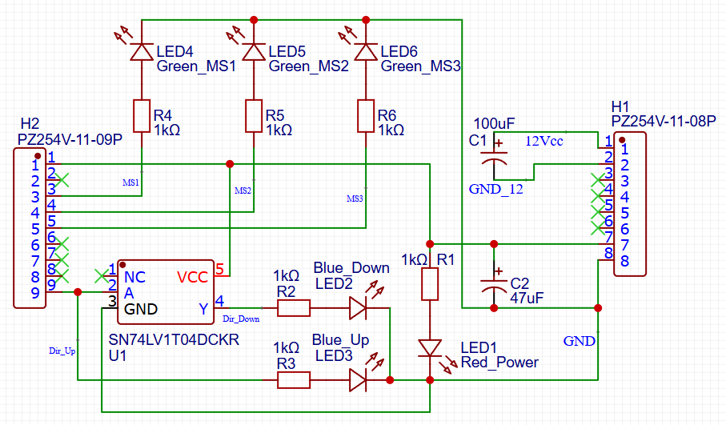

# Overview
The A4988N_Upgrade project is a custom-designed PCB intended to host an A4988N stepper motor driver. It enhances the functionality of the standard module by providing built-in LED indicators and onboard power stabilization. The board simplifies debugging and monitoring by visually displaying power status, microstepping configuration, and motor direction. It also offers convenient pin headers for easy integration with microcontrollers or other control logic.

This board has been successfully tested with a NEMA 17 stepper motor, demonstrating stable and reliable performance.

# Features and Design
The custom PCB includes a red LED that lights up when the 5V logic voltage is present, clearly indicating that the board is powered. To monitor the microstepping configuration, three green LEDs are connected to the MS1, MS2, and MS3 pins of the A4988N driver. These LEDs reflect the selected microstepping mode, whether full, half, quarter, eighth, or sixteenth step.

Motor direction is indicated visually through two blue LEDs. An inverter circuit is placed between the driver's DIR pin and the two LEDs, ensuring that one LED lights up for one direction and the other for the opposite direction. 

The PCB includes two onboard capacitors for power stabilization: a 47μF capacitor on the 5V logic line and a 100μF capacitor on the 12V motor power line. These capacitors help suppress voltage spikes and smooth power delivery.

Several pin headers are available for easy connection to a microcontroller or any logic system controlling the A4988N driver. Essential control pins such as STEP, DIR, ENABLE, RESET, and SLEEP are broken out. If the RESET and SLEEP functions are not used, they can be simply bridged together with a pin header bridge, allowing the driver to operate normally without additional control signals. An optional bridge can also connect 5V to ENABLE, forcing the driver to remain disabled at all times. Otherwise, leaving ENABLE floating is acceptable, as it is active-low and internally pulled down to ground.

Each corner of the PCB includes a 3mm diameter mounting hole, allowing secure attachment to an enclosure, chassis, or mounting frame.

The board layout is optimized for ease of assembly and integration by utilizing a single-sided design, making it well-suited for both prototypes and small production runs.

# Current Limiting
When using the A4988N driver, it is essential to correctly configure the motor current limit to protect both the driver and the stepper motor. The adjustment is made by turning the small potentiometer located on the A4988N module itself. Correct current limiting must be set regardless of whether the driver is used on this custom PCB or in any other setup. Consult the A4988N datasheet or manufacturer recommendations to determine the correct reference voltage (Vref) corresponding to your motor's rated current.

# Usage
To use the board, solder the A4988N driver onto the designated footprint. Connect the stepper motor phases to the 1A–1B and 2A–2B outputs, the logic control signals (STEP, DIR, ENABLE), and the power supplies (5V for logic and 12V for the motor). Ensure that the power supplies and control signals match the operating specifications of the driver and motor.

It is recommended to attach a heat sink to the A4988N driver, in order to maintain safe operating temperatures and prolong the driver's lifespan.

In the schematic, 1kΩ through-hole resistors are used for the LEDs. However, resistor values can be adjusted depending on the specific LEDs selected, based on their forward voltage and desired brightness. Similarly, the onboard capacitors — 47μF for the 5V line and 100μF for the 12V line — can be adapted according to the motor's requirements and the characteristics of the power supply.

# License and Applications
This project is released as open hardware. You are free to use, modify, and distribute it for personal, educational, or commercial purposes.

The A4988N_Upgrade board is ideal for applications requiring precise stepper motor control, including CNC machines, 3D printers, robotics, and DIY motion control projects. It is particularly useful in situations where real-time visual feedback on system status is valuable for operation, debugging, or educational demonstrations.

